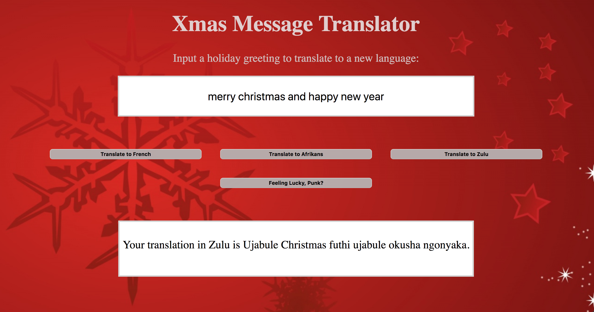

# JS Translator

This project was for an assignment to translate an input text to one of three limited languages contained in objects.

I created a translator function triggered by buttons and also a randomizing component that randomly selects a language when the 'random' button is clicked.

Finally, for extra credit, I used SpeechSynthesisUtterance in JavaScript to vocalize the translated text.

## Screenshots

​

## How to run this project:

* Use nmp to install htpp-server:

```sh

npm install -g http-server

```
* Run the server:

```sh

hs -p 9999

```

* Open Chrome and navigate to:

```

localhost:9999

```


​
